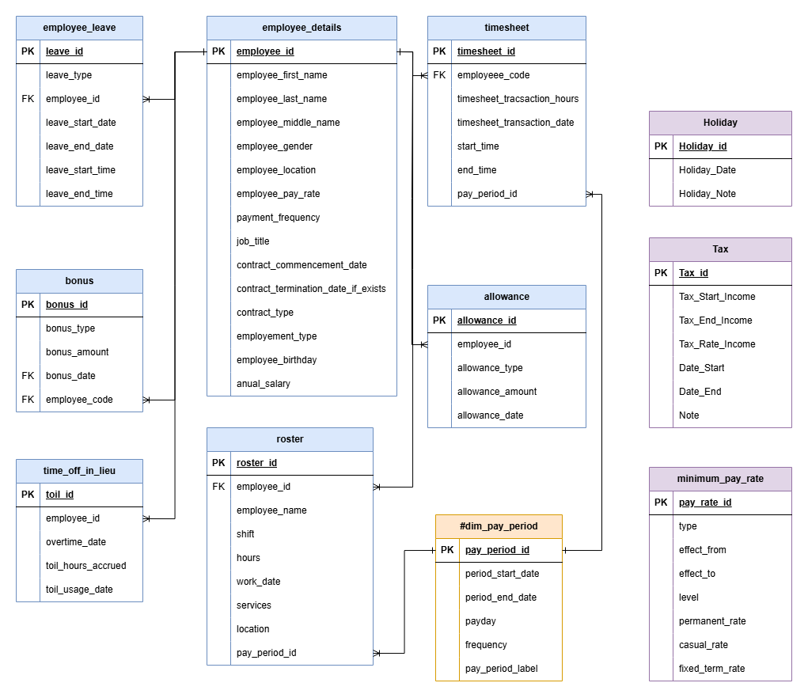
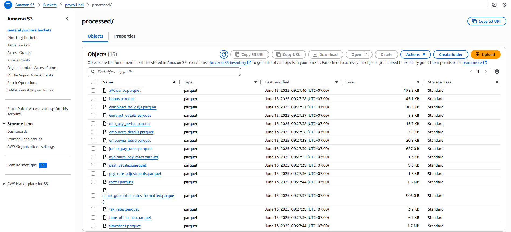

# Payroll Data Pipeline

This project demonstrates a modern data pipeline for automating the extraction, transformation, and loading (ETL) of payroll and HR data. The pipeline centralizes payroll data, enabling efficient processing, compliance, and analytics to support HR and finance operations.

## Table of Contents
- [Payroll Data Pipeline](#payroll-data-pipeline)
  - [Table of Contents](#table-of-contents)
  - [Architecture](#architecture)
  - [Project Structure](#project-structure)
  - [Data Source](#data-source)
  - [Quickstart](#quickstart)
    - [Clone the repository](#clone-the-repository)
    - [Setup virtual environment](#setup-virtual-environment)
    - [Start services](#start-services)
  - [Tech Stack](#tech-stack)
    - [Apache Airflow](#apache-airflow)
    - [Amazon S3](#amazon-s3)
    - [DuckDB](#duckdb)
    - [Snowflake](#snowflake)
    - [dbt \& Great Expectations](#dbt--great-expectations)
    - [PowerBI](#powerbi)
  - [Business Insights](#business-insights)
    - [Payroll Overview](#payroll-overview)
    - [Recommendations](#recommendations)

## Architecture

<!-- Add a diagram if available -->
<p align="center">
    
    </br>
  Project Architecture
</p>

## Project Structure
```shell
.
├── airflow/                /* Airflow folder, contains DAGs and scripts */
├── assets/                 /* Assets folder, contains diagrams, dashboards, etc. */
├── dbt_payroll/            /* dbt project folder, contains dbt models */
├── docker/                 /* Docker services configuration folder */
│   ├── airflow/               /* Airflow orchestrator configurations */
│   ├── spark-app              /* Spark container for transformation logic */
│   ├── spark-master           /* Spark container for distributing workloads */
│   ├── spark-worker           /* Spark container for code execution */
├── .gitignore
├── .python-version
├── uv.lock
├── README.md
├── snowflake-setup.md      /* Instructions to setup Snowflake beforehand */
├── pyproject.toml          /* Project dependencies, run uv sync in virtual environment */
├── docker-compose.yaml     /* Docker Compose file to define services */
└── Makefile                /* Makefile for automating tasks and commands */
```

## Data Source

The payroll datasets include employee records, salary details, attendance logs, tax deductions, and benefits information. These are typically exported from HR/payroll systems and ingested into the pipeline for processing and analytics.

<p align="center">
    
    </br>
  Source Relational Model
</p>

## Quickstart

> **Prerequisites:**
> - **Git** for version control.
> - **uv** or **Conda/Mamba** for virtual environment management.
> - **Docker** for containerization.
> - **Makefile** (optional) for automating Docker commands.

### Clone the repository
```shell
git clone https://github.com/cdoge25/payroll-project.git
```

### Setup virtual environment
Navigate to your cloned directory:
```shell
uv venv --python 3.11
source .venv/Scripts/activate
uv sync
```

### Start services

> - Create a `.env` file at the root level for environment variables (see `.env.example`).
> - Ensure any required data files are placed in the appropriate folders as described in the documentation.

To start all services:
```shell
make up
```
Or, without Makefile:
```shell
docker compose up -d --build
```

## Tech Stack

### Apache Airflow
Orchestrates ETL workflows for payroll data processing.
<p align="center">
    
    </br>
  Airflow overview
</p>

### Amazon S3
Data Lake
<p align="center">
    
    </br>
  Amazon S3 overview
</p>

### DuckDB
Used for lightweight data transformation and analytics at the data lake layer.

### Snowflake
Data Warehouse
<p align="center">
    
    </br>
  Snowflake overview
</p>

### dbt & Great Expectations
dbt transforms data into analytics-ready models; Great Expectations validates data quality.
<p align="center">
    
    </br>
  dbt overview
</p>

### PowerBI
For dashboarding and visualization of payroll analytics.
<p align="center">
    
    </br>
  PowerBI overview
</p>

## Business Insights

Once the pipeline is operational, you can generate insights such as:

### Payroll Overview
- Total payroll expenses by month, department, or location.
- Trends in salary, overtime, and deductions.

### Recommendations
- Optimize payroll schedules to improve cash flow.
- Target retention strategies for key employee segments.
- Automate compliance checks to reduce audit risks.

---

<p>&copy; 2025 cdoge25 |  Nguyen Duc Thien Hai</p>
